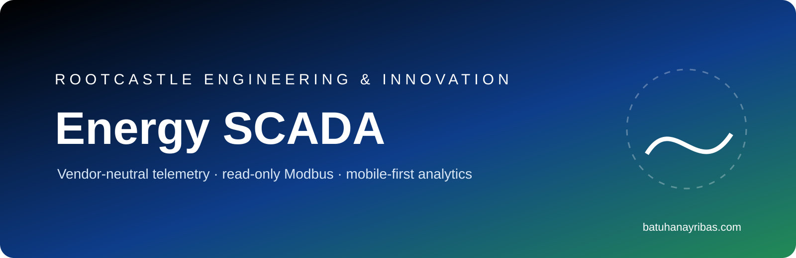
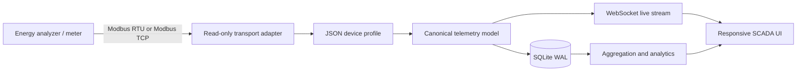

<p align="center">
  
</p>

# Rootcastle Energy SCADA

Vendor-neutral, mobile-first energy telemetry and analytics over read-only industrial protocols.

Published by **Rootcastle Engineering & Innovation** and authored by **Batuhan Ayrıbaş**. The project separates transport, device register profiles, canonical telemetry, storage, analytics and UI so another meter can be integrated without modifying the SCADA core.

## Architecture



## Included profile

- **ENTES MPR-53S — verified**, Modbus RTU read-only profile.

## Documented device ecosystems

- Türkiye: ENTES, Klemsan, Tense
- European/global: Schneider Electric PowerLogic, Siemens SENTRON, ABB, Socomec, Janitza, Carlo Gavazzi, Lovato Electric, Phoenix Contact, WAGO, Weidmüller, Iskra, Circutor, SATEC, Algodue, Electrex
- Asia-Pacific/India: Delta, Mitsubishi Electric, Omron, Panasonic, Yokogawa, Selec, L&T, Rishabh, Secure, Eastron, CHINT, Acrel
- North America: Rockwell Automation, Eaton, GE Vernova/Multilin, Accuenergy, Veris, DENT Instruments
- Generation/storage: SMA, Fronius, SolarEdge, Huawei, Sungrow, GoodWe, Growatt, Victron, FIMER, Delta
- Building/utility/charging: BACnet, OPC UA, MQTT, DLMS/COSEM, IEC 61850 and OCPP through separate adapters

A listed manufacturer is not automatically plug-and-play. Each exact model requires a validated register map and byte-order/scaling verification.

## Quick start

```bash
cp .env.example .env
docker compose up --build
```

Open `http://localhost:8080`. The default mode is a deterministic simulator.

## Security

- Read-only Modbus FC03/FC04
- No fieldbus writes
- Bounded register reads and polling intervals
- OT/VLAN isolation recommended
- SQLite WAL and health/readiness endpoints
- Prometheus-format metrics

## Brand

- Rootcastle Engineering & Innovation: https://rootcastle.com
- Batuhan Ayrıbaş: https://batuhanayribas.com
- Palette: `#000000`, `#0E3D8A`, `#228B55`

Third-party names identify potential device ecosystems and remain trademarks of their respective owners. No manufacturer endorsement is implied.

## License

MIT, see [LICENSE](LICENSE).
