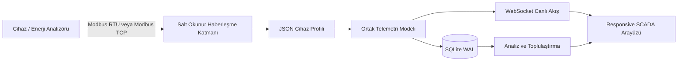

<p align="center">
  
</p>

# Rootcastle Energy SCADA

**Marka bağımsız, mobil öncelikli, salt okunur endüstriyel enerji izleme ve analiz platformu.**

Rootcastle Engineering & Innovation tarafından geliştirilmiştir. Proje sahibi ve geliştirici: **Batuhan Ayrıbaş** — [batuhanayribas.com](https://batuhanayribas.com)

<p align="center">
  
  
</p>

## Projenin amacı

Rootcastle Energy SCADA; enerji analizörleri, sayaçlar, inverterler, UPS sistemleri ve benzeri endüstriyel cihazlardan alınan verileri ortak bir telemetri modeline dönüştürür. Cihazın marka veya modeline özgü register yapısı, çekirdek uygulamadan ayrılmış JSON profilleriyle tanımlanır.

Bu mimari sayesinde yeni bir cihaz eklemek için çoğu durumda yalnızca yeni bir profil hazırlanır; arayüz, veri tabanı, API ve analiz motoru değiştirilmez.

## Ölçülen ve izlenen değerler

- Faz-nötr ve faz-faz gerilimleri
- Faz akımları ve nötr akımı
- Aktif güç tüketimi ve üretimi
- Endüktif ve kapasitif reaktif güç
- Görünür güç
- Güç faktörü ve frekans
- Gerilim ve akım THD değerleri
- Aktif ve reaktif enerji sayaçları
- Saatlik, günlük ve haftalık tüketim
- En yüksek ve en düşük tüketim zamanları
- Yedi günlük tüketim ısı haritası
- Faz dengesizliği ve enerji kalitesi göstergeleri
- Bağlantı sağlığı, veri tazeliği ve hata olayları

## Mimari



```text
Haberleşme sürücüsü -> cihaz profili -> ortak telemetri -> veri tabanı/API -> kullanıcı arayüzü
```

## Desteklenen haberleşme yöntemleri

### Hazır altyapı

- Modbus RTU / RS-485
- Şeffaf TCP-to-RTU ağ geçidi
- Modbus TCP
- Function Code 03 ve 04 ile salt okunur register okuma

### Ayrı adaptörle eklenebilir

- BACnet/IP
- OPC UA
- MQTT
- DLMS/COSEM
- IEC 61850
- OCPP
- HTTP/REST tabanlı cihaz API'leri

## Cihaz uyumluluk seviyeleri

| Durum | Açıklama |
|---|---|
| **Doğrulandı** | Register haritası, veri türleri ve ölçekler test edilmiştir. |
| **Deneysel** | Profil vardır fakat ilgili model veya firmware için saha doğrulaması tamamlanmamıştır. |
| **Profil eklenebilir** | Marka ailesinde Modbus cihazlar vardır; model dokümanı ile profil hazırlanabilir. |
| **Adaptör gerekli** | Cihaz farklı bir protokol kullandığı için yeni haberleşme adaptörü gerekir. |

### Paketle gelen doğrulanmış profil

- **ENTES MPR-53S** — Modbus RTU, salt okunur profil

### Profil geliştirilebilecek marka ve cihaz ekosistemleri

Aşağıdaki markaların tamamı otomatik olarak tak-çalıştır destekleniyor anlamına gelmez. Her model için üretici register dokümanı, firmware sürümü, byte/word order ve ölçek değerleri doğrulanmalıdır.

#### Türkiye

- ENTES
- Klemsan
- Tense
- Esem
- Federal Elektrik
- Sigma Elektrik
- Makel

#### Avrupa ve küresel endüstriyel gruplar

- Schneider Electric PowerLogic
- Siemens SENTRON
- ABB M2M / M4M
- Socomec DIRIS
- Janitza UMG
- Carlo Gavazzi EM / WM
- Lovato Electric DMG
- Phoenix Contact EMpro
- WAGO
- Weidmüller
- Gossen Metrawatt / Camille Bauer
- Iskra
- Circutor
- SATEC
- Algodue
- Electrex
- Eastron

#### Asya-Pasifik ve Hindistan

- Delta Electronics
- Mitsubishi Electric
- Omron
- Panasonic
- Yokogawa
- Selec
- Larsen & Toubro
- Rishabh
- Secure Meters
- CHINT
- Acrel
- Fuji Electric
- Autonics

#### Kuzey Amerika

- Rockwell Automation / Allen-Bradley
- Eaton
- GE Vernova / Multilin
- Accuenergy
- Veris Industries
- DENT Instruments
- Electro Industries / GAI-Tronics

#### İnverter, güneş enerjisi ve depolama

- SMA
- Fronius
- SolarEdge
- Huawei
- Sungrow
- GoodWe
- Growatt
- Victron Energy
- FIMER
- Delta
- Solis
- KSTAR

#### Jeneratör, UPS ve güç kontrol sistemleri

- ComAp
- Deep Sea Electronics
- Datakom
- Socomec
- APC / Schneider Electric
- Eaton UPS
- Vertiv
- Riello UPS

## Hızlı başlangıç

### Docker Compose

```bash
git clone https://github.com/rootcastleco/rootcastle-energy-scada.git
cd rootcastle-energy-scada
cp .env.example .env
docker compose up --build
```

Arayüz:

```text
http://localhost:8080
```

Varsayılan çalışma modu simülatördür. Fiziksel cihaz olmadan arayüz, API ve analiz fonksiyonları görülebilir.

### Yerel Python kurulumu

```bash
python -m venv .venv
. .venv/bin/activate
pip install -r requirements.txt
cp .env.example .env
uvicorn app.main:app --host 0.0.0.0 --port 8080
```

Windows PowerShell:

```powershell
python -m venv .venv
.venv\Scripts\Activate.ps1
pip install -r requirements.txt
Copy-Item .env.example .env
uvicorn app.main:app --host 0.0.0.0 --port 8080
```

## Gerçek cihaza bağlanma

`.env` dosyasını düzenleyin:

```dotenv
SCADA_MODE=device
DEVICE_PROFILE=entes-mpr53s
MODBUS_TRANSPORT=tcp_rtu
MODBUS_HOST=192.168.1.50
MODBUS_PORT=5020
MODBUS_SLAVE_ID=1
MODBUS_BAUD=9600
MODBUS_PARITY=N
MODBUS_STOP_BITS=2
```

### Transport seçenekleri

| Değer | Kullanım |
|---|---|
| `serial_rtu` | USB-RS485 veya yerel seri port |
| `tcp_rtu` | Şeffaf Ethernet-RS485 dönüştürücü |
| `modbus_tcp` | Yerel Modbus TCP cihazı veya ağ geçidi |

Başka marka veya modelde yukarıdaki değerleri kopyalamayın. Cihazın kendi kullanım kılavuzu ve register tablosu esas alınmalıdır.

## Cihaz profili yapısı

Profiller `profiles/` dizinindedir. Bir profil şunları tanımlar:

- Üretici ve model
- Doğrulama durumu
- Modbus function code
- Register başlangıç adresi ve uzunluğu
- Veri türü: `uint16`, `int16`, `uint32`, `int32`, `uint64`, `int64`, `float32`, `float64`
- Ölçek ve birim
- Byte/word order: `ABCD`, `BADC`, `CDAB`, `DCBA`
- Polling sınıfı
- Ortak telemetri alanı

Örnek profil alanı:

```json
{
  "key": "active_power_total",
  "canonical": "power.active_total_kw",
  "address": 44,
  "type": "int32",
  "scale": 0.0001,
  "unit": "kW",
  "order": "ABCD"
}
```

## API uçları

| Endpoint | Açıklama |
|---|---|
| `/api/v1/live` | Son canlı ölçüm ve cihaz sağlığı |
| `/api/v1/device-profile` | Aktif cihaz profili |
| `/api/v1/device-profiles` | Kurulu cihaz profilleri |
| `/api/v1/history` | Zaman serisi geçmişi |
| `/api/v1/analytics` | Saatlik/günlük analiz ve ısı haritası |
| `/api/v1/events` | Sistem ve cihaz olayları |
| `/ws/live` | Canlı WebSocket telemetrisi |
| `/livez` | Süreç canlılık kontrolü |
| `/readyz` | Veri üretme hazırlığı |
| `/healthz` | Cihaz bağlantısı ve veri tazeliği |
| `/metrics` | Prometheus formatında metrikler |

## Veri tabanı ve analitik

- SQLite WAL modu
- Ölçüm ve olay tabloları
- Enerji sayaç farklarından tüketim hesabı
- Sayaç sıfırlanması ve aykırı değer algılama
- Gerektiğinde aktif güç integrasyonuyla yedek hesaplama
- Saatlik ve günlük tüketim toplulaştırması
- Yedi günlük ısı haritası
- En yüksek ve en düşük tüketim saatleri

## Güvenlik modeli

Platform cihazdan veri okumak için tasarlanmıştır; kontrol veya register yazma işlevi içermez.

### Temel kontroller

- Yalnızca Modbus Function Code 03 ve 04
- Yazma fonksiyonlarına izin verilmez
- Register sayısı ve paket boyutları sınırlandırılır
- Bağlantı ve okuma zaman aşımı uygulanır
- Hatalar sessizce yutulmaz; event ve metrik olarak kaydedilir
- Container root olmayan kullanıcıyla çalışır
- Dosya sistemi salt okunur çalıştırılabilir
- OT ağı doğrudan internete açılmamalıdır
- Reverse proxy üzerinde TLS ve kimlik doğrulama kullanılmalıdır

## Testler

```bash
python -m pytest -q
python -m compileall -q app
```

Test kapsamı:

- Modbus CRC16
- RTU normal ve exception frame uzunluğu
- Signed/unsigned 16/32/64-bit çözümleme
- IEEE-754 float çözümleme
- Byte/word order permütasyonları
- Cihaz profili şema doğrulaması
- Enerji sayacı farkı, sıfırlanması ve aykırı değer davranışı
- Depolama ve saatlik tüketim analitiği

## Dağıtım

### Docker

```bash
docker compose up -d --build
```

### systemd

Örnek servis:

```text
systemd/rootcastle-energy-scada.service
```

### Sağlık kontrolü

```bash
curl http://localhost:8080/livez
curl http://localhost:8080/readyz
curl http://localhost:8080/healthz
```

## Yeni cihaz ekleme süreci

1. Üreticinin resmi register tablosunu temin edin.
2. Model ve firmware sürümünü kaydedin.
3. Slave ID, baud rate, parity ve stop bit değerlerini doğrulayın.
4. Function 03/04 seçimini doğrulayın.
5. Register adresleme tabanının 0 veya 1 olup olmadığını belirleyin.
6. Veri türü, byte order, word order ve ölçeği test edin.
7. `profiles/` altında yeni JSON profil oluşturun.
8. Bilinen gerçek ölçümlerle fixture ve test ekleyin.
9. Simülatör, masaüstü ve mobil görünümü doğrulayın.
10. Profil durumunu yalnızca kanıt varsa `verified` yapın.

## Sürümleme

- Kararlı sürüm: `v1.0.0`
- Ana kararlı seri etiketi: `v1`
- Değişiklik geçmişi: [CHANGELOG.md](CHANGELOG.md)
- GitHub Release sayfası: [Releases](https://github.com/rootcastleco/rootcastle-energy-scada/releases)

## Proje yapısı

```text
app/                 FastAPI, Modbus, profil, depolama ve simülatör
profiles/            Marka/model cihaz profilleri
static/              Responsive web SCADA arayüzü
tests/               Otomatik testler
docs/                Teknik ve uyumluluk dokümanları
systemd/             Linux servis örneği
.github/workflows/   CI doğrulaması
Dockerfile           Container imajı
docker-compose.yml   Yerel ve sunucu dağıtımı
```

## Marka ve telif

- Rootcastle Engineering & Innovation — [rootcastle.com](https://rootcastle.com)
- Batuhan Ayrıbaş — [batuhanayribas.com](https://batuhanayribas.com)

Rootcastle renkleri:

- Siyah: `#000000`
- Mavi: `#0E3D8A`
- Yeşil: `#228B55`

Bu README'de geçen üçüncü taraf marka adları yalnızca teknik uyumluluk ve cihaz ekosistemlerini tarif etmek amacıyla kullanılmıştır. Her marka kendi sahibinin ticari markasıdır. Herhangi bir üretici onayı veya ortaklığı ima edilmez.

## Katkı

Yeni cihaz profilleri, hata düzeltmeleri ve test katkıları kabul edilir. Her cihaz profili resmi register kaynağı, model/firmware bilgisi ve doğrulama kanıtı içermelidir.

Bkz. [CONTRIBUTING.md](CONTRIBUTING.md)

## Lisans

MIT Lisansı. Ayrıntılar için [LICENSE](LICENSE) dosyasına bakın.
